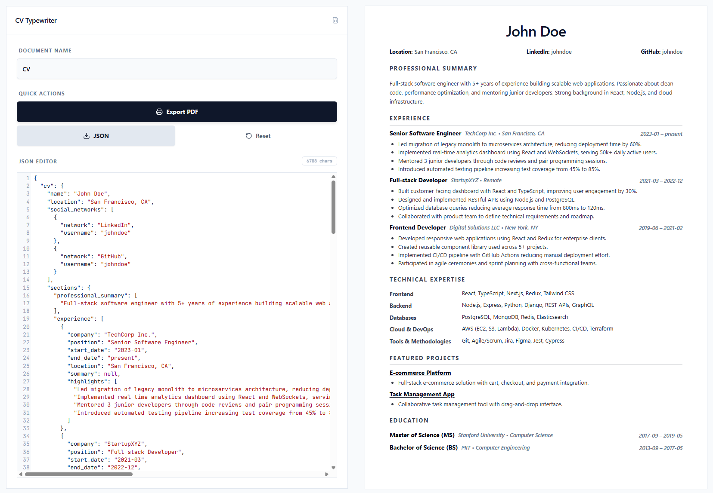

# CV Typewriter

**CV Typewriter** is a minimalist, developer-focused web application for crafting professional CVs using a **data-first approach**. By decoupling your career data from its visual representation, it ensures your CV remains portable, version-controllable, and always looks perfect.


<p align="center">
  
</p>

## Key Features

- **Live JSON Editor**: Real-time CV updates as you edit your data.
- **RenderCV Compatibility**: Uses a standardized schema, making your data portable across other CV tools.
- **Oxford-Inspired Design**: Professional, clean typography focused on hierarchy and readability.
- **A4 Print Optimized**: Dedicated CSS and paginated preview ensure clean PDF output.
- **Smart Page Splitting**: Content blocks are measured and flowed across pages to avoid awkward splits.
- **Markdown Support**: Use standard Markdown syntax (e.g., `[Title](Link)`) in your descriptions to generate clickable links.
- **Git Friendly**: Your CV is just a JSON file. Track changes, branch, and pull request your career updates.

## Getting Started

### Prerequisites

- Node.js (v18 or higher)
- npm or yarn

### Installation

1. Clone the repository:

   ```bash
   git clone https://github.com/RafaGonzalezDev/cv-typewriter.git
   cd cv-typewriter
   ```

2. Install dependencies:

   ```bash
   npm install
   ```

3. Start the development server:

   ```bash
   npm run dev
   ```

4. Open [http://localhost:5173](http://localhost:5173) in your browser.

## Tech Stack

- **React 18** - UI Framework
- **Vite** - Build Tool & Development Server
- **Tailwind CSS** - Styling
- **Shadcn/UI** - Premium UI Components
- **Lucide React** - Iconography

## How to Use

1. **Edit**: Modify the JSON content in the editor at the top.
2. **Preview**: See the live results in the A4 canvas with real page breaks.
3. **Export**:
   - Click **"Export PDF"** and save using your browser's native print-to-PDF feature (Optimized for A4).
   - Click **"JSON"** to save your raw data as a portable file.

## Contributing

Contributions are welcome. Feel free to open an issue or submit a pull request if you have ideas for new templates or features.

## License

This project is licensed under the MIT License - see the [LICENSE](LICENSE) file for details.

---

Crafted by [Rafa González](https://github.com/RafaGonzalezDev)
